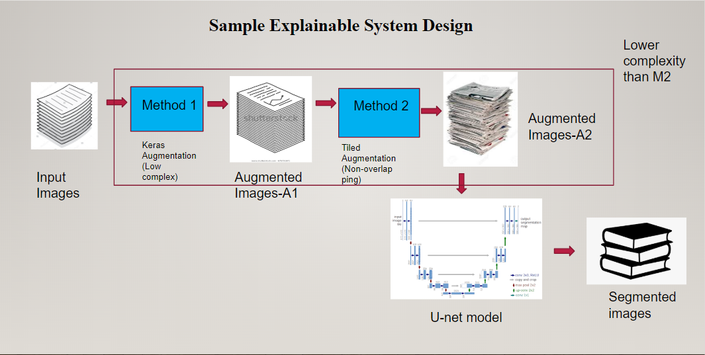
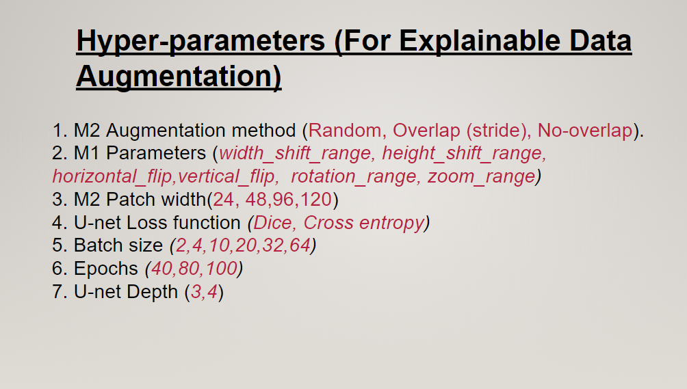
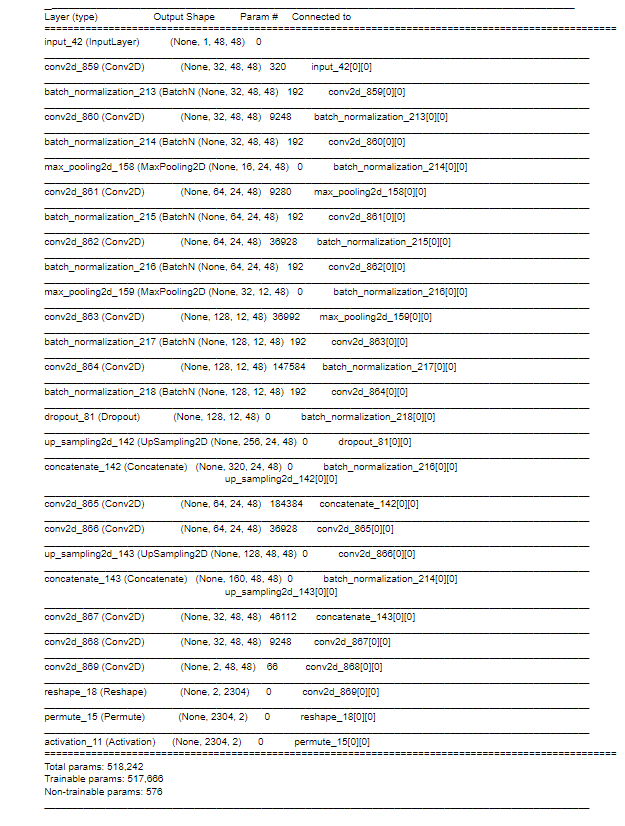

# Explainable and End-to-end Image Data Augmentation for Semantic Segmentation using U-net
This code base augments image data sets to enable semantic segmentation using the U-net model. Explanation of an explainable end-to-end pipeline is in https://www.youtube.com/watch?v=44QzNcU0k2Y&t=1s

This codebase marks the end of the 10-week program "Build Your Own Research Internship in AI, 2020" https://www.youtube.com/watch?v=1kiPy2tvECs&list=PLQKflBw-kPeecjC345saTF2YrfImciCrr
Google drive for weekly materials: https://drive.google.com/drive/u/2/folders/1pYMjFe4bxH5qawFYl4NGM4C6yQIVDOCy

## Pre-requisite Python Packages
Video Explaning coding environment: https://www.youtube.com/watch?v=d7ktNAVHo5E&t=453s
* tensorflow>=1.6<2.0
* keras>2.0
* opencv-python
* numpy
* pydot
* graphviz
* matplotlib 
* pillow

## Proposed System Diagram

This code base improves the explainability and generalizability of the image-tiling data augementation strategy in [1] in the following two ways:
1. The end-to-end data augmentation method in [1] generates 190,000 random tiled sub-images from a set of 20 images. The proposed method is sensitive to the random number gennerator and can over or under-represent certain regions of the image. Generating non-overlapping tiles (in this code base) reduces such imbalanced image representations and ensures generalizability across data sets.
1. Method in [1] requires significant compute power to train 3-4 u-net layers for 100 epochs. The proposed method significantly reduces compute since comparable segmentation accuracy is achieved by the proposed system in 50 epochs.

Other contributions of the proposed code base are:
1. Hyper-parameters selected for method [2] to zoom into retinal regions.
1. Batch normalization and dropout added to implementations of [1] and [2] for quicker convergence.
1. U-net model for depth 3 and 4 generalized across method [1] and [2]. 
1. Hyperparamaterization and Ablation Study performed.

### Implementation Steps
1. Clone and download all the code.
1. Download the DRIVE data from https://drive.grand-challenge.org/. Unpack the data under fundus/DRIVE/training and fundus/DRIVE/test. Create 3 folders for images, GT (groundtruth or annotations) and mask (borders) for training and test set each.
1. Run the main function main_xai_e2e_aug.py (Step by step)
	1. Verify that images, GT, mask under fundus/training/aug are correctly formed. Count the number of images generated per folder (N=480). This number has to be added to prep_data function. This will run model M1 [2].
	1. Verify the "configuration.txt" file is correctly downloaded, since parameters are read from that file directly.
	1. Run the prep_data(N) command. This will generate .h5py files. Now we are ready to run model M2
	1. Next, line 20 invokes U-net train. To modify the depth of U-net, change get_unet to get_gnet in Line 186 in file u_net_with_patches_train.py. Modify epochs and patch size in configuration.txt file. To complete 50-100 epochs may take time depending on your CPU/GPU setup.
	1. Line 22 tests the trained network on test data and evaluates the sensitivity, specificity, precision, Recall, IoU, F1score
### Hyper-parameterization

These parameters need to be optimized for best joint parameter selection. Grid search applied for best parameters:
1. M2: No Overlap optimal for computational complexity reduction
1. M1 parameters:
	1. rotation_range=0.3,
	1. width_shift_range=0.05,
	1. height_shift_range=0.05,
 	1. shear_range=0.1,
	1. zoom_range=[0.5,1],
	1. horizontal_flip=True,
	1. fill_mode='nearest'
1. M2 Patch Width: 48
1. Cross entropy loss
1.  Batch size 32
1. Epochs: 50
1.  U-net depth:3

To see the model complexity (number of parameters), use the command:
model.summary() [Line 187 u_net_with_patches_train.py]

To print shape of any intermediate U-net layer: print( <layername>._keras_shape)
	
### Results
Method| F1_score|Accuracy
------------ | -------------|-----------------------
M1 [2], 4-layer U-net (30 epochs)| 0.75|0.9557
------------ | -------------|-----------------------
M2 [1], 3-layer U-net (110 epochs)|0.80|0.96
------------ | -------------|-----------------------
Proposed, 3 layer U-net (50 epochs)|0.791|0.96
------------ | -------------|-----------------------

#### References
[1]Orobix. "Retina blood vessel segmentation with a convolution neural network (U-net)" ][Online] https://github.com/orobix/retina-unet
[2]Zhixhao. "Implementation of deep learning framework -- Unet, using Keras" [Online] https://github.com/zhixuhao/unet

